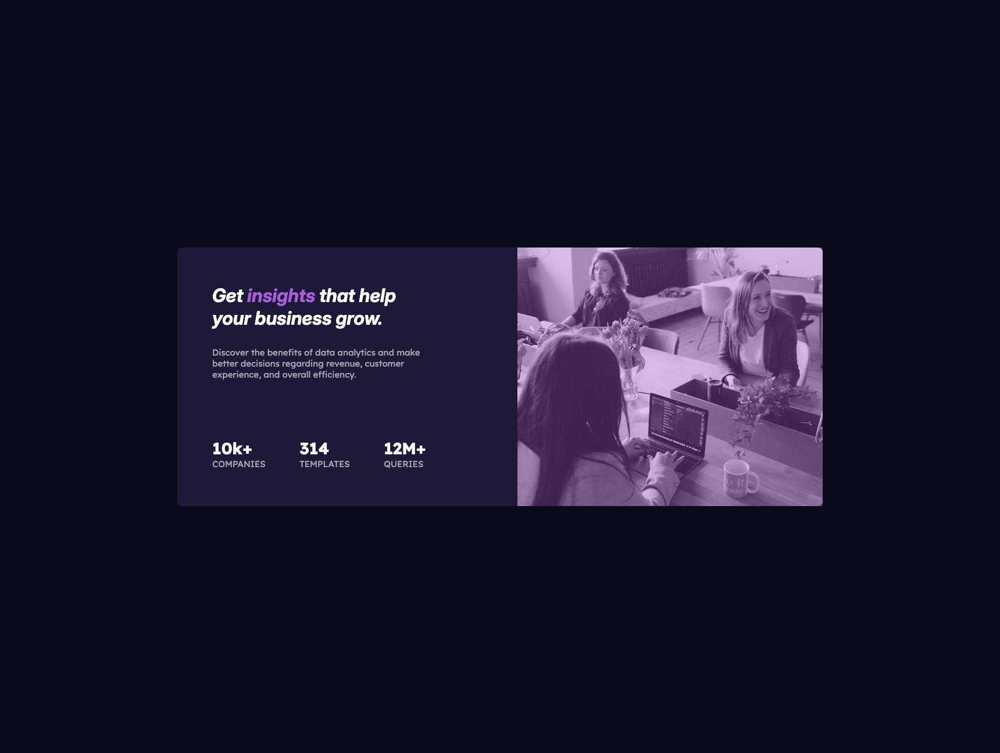

# Frontend Mentor - Product preview card component solution

This is a solution to the [Product preview card component challenge on Frontend Mentor](https://www.frontendmentor.io/challenges/product-preview-card-component-GO7UmttRfa). Frontend Mentor challenges help you improve your coding skills by building realistic projects. 

## Table of contents

- [Overview](#overview)
  - [The challenge](#the-challenge)
  - [Screenshot](#screenshot)
  - [Links](#links)
- [My process](#my-process)
  - [Built with](#built-with)
  - [What I learned](#what-i-learned)
  - [AI Collaboration](#ai-collaboration)
- [Author](#author)

## Overview

### The challenge

Users should be able to:

- View the optimal layout depending on their device's screen size
- See hover and focus states for interactive elements

### Screenshot

### Links

- Solution URL: [Add solution URL here](https://github.com/AmirDujak/stats-preview-card-component)
- Live Site URL: [Add live site URL here](https://stats-preview-card-component-ten-blue.vercel.app/)

## My process

### Built with

- Semantic HTML5 markup
- CSS custom properties
- Flexbox
- Desktop-first workflow
- [React](https://reactjs.org/) - JS library

### What I learned

Before I started to write even a single line, I decided to prepare a layout of the page by hand-drawing it, and it made my life easier.

### AI Collaboration

I used Claude to teach me some basic stuff about padding and margin. For example: I forgot about the box-sizing property on reset, and Claude reminded me about it.

## Author

- Frontend Mentor - [@AmirDujak](https://www.frontendmentor.io/profile/AmirDujak)